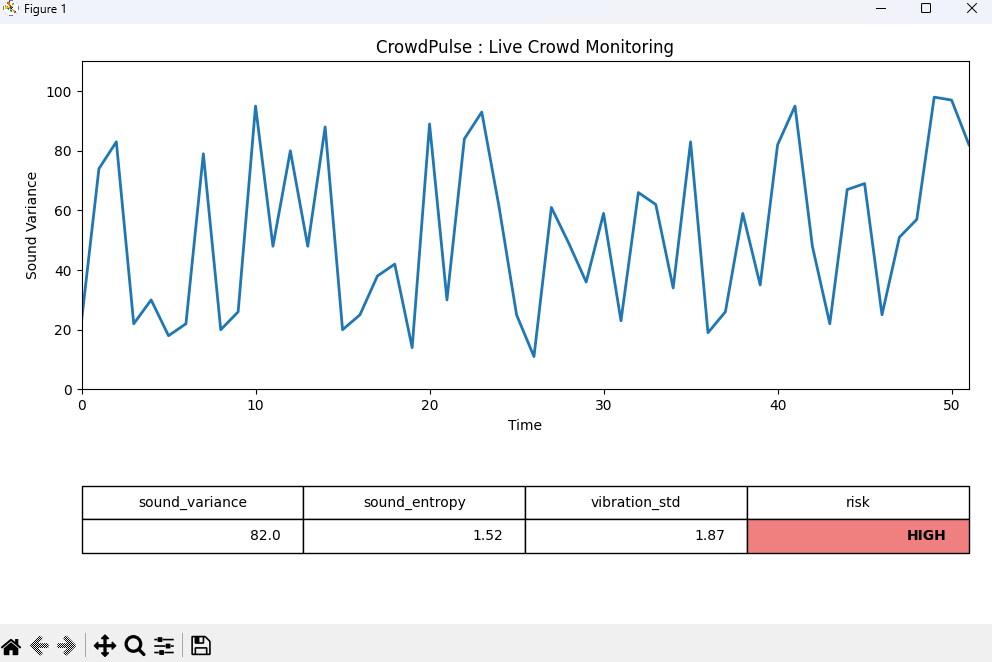

# CrowdPulse-AI-Crowd-Panic-Detection
CrowdPulse is an AI-based crowd monitoring system that detects abnormal behavior and potential panic situations using simulated sensor data, anomaly detection, and live visualizations.
# 🚨 CrowdPulse
### AI-Based Crowd Panic Detection System

CrowdPulse is an intelligent crowd monitoring system that detects
panic-like behavior using unsupervised machine learning techniques.

---

## 📌 Problem Statement
Large public gatherings often face sudden panic situations due to
noise spikes, vibrations, or abnormal movement, leading to stampedes.
Traditional alarm systems produce false alerts.

---

## 💡 Proposed Solution
CrowdPulse learns normal crowd behavior patterns and detects anomalies
that may indicate panic situations, allowing early intervention.

---

## 🧠 Technology Stack
- Python
- NumPy
- Pandas
- Scikit-learn
- Isolation Forest Algorithm
## ⚙️ System Workflow
1. Collect sound and vibration features
2. Train model on normal crowd behavior
3. Detect abnormal deviations
4. Classify risk level as LOW or HIGH

---

## 📊 Output
- *LOW RISK* → Normal crowd behavior
- *HIGH RISK* → Possible panic situation

---

## 🖼️ Sample Output

---

## 👨‍🎓 Team Details
- 1st Year Engineering Students  
- Domains: EE, AIML
-
-
-
## 🚀 Future Scope
- Real-time sensor integration
- CCTV and drone-based analysis
- Smart city deployment

---

## 📜 License
This project is licensed under the MIT License.
